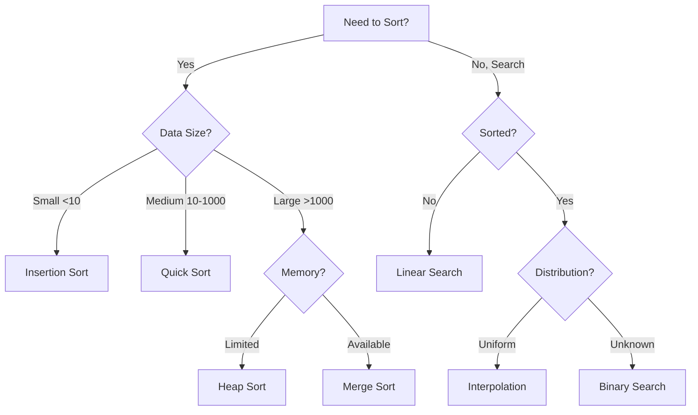

# 🎯 Advanced Algorithm Visualizer

<div align="center">


[](https://www.python.org/)
[](https://matplotlib.org/)
[](https://opensource.org/licenses/MIT)
[](http://makeapullrequest.com)

**A comprehensive, interactive desktop application for visualizing and analyzing sorting algorithms, search algorithms, and binary search tree operations with real-time animations and performance metrics.**

[Features](#-key-features) • [Installation](#-installation) • [Quick Start](#-quick-start) • [Documentation](#-documentation) • [Contributing](#-contributing)

---


*Real-time visualization of sorting algorithms with pause, step, and speed controls*

</div>

---

## 📋 Table of Contents

- [Overview](#-overview)
- [Key Features](#-key-features)
- [Installation](#-installation)
- [Quick Start](#-quick-start)
- [Documentation](#-documentation)
  - [Sorting Algorithms](#sorting-algorithms)
  - [Search Algorithms](#search-algorithms)
  - [Tree Operations](#tree-operations)
- [User Interface](#-user-interface)
- [Keyboard Shortcuts](#-keyboard-shortcuts)
- [Algorithm Complexity](#-algorithm-complexity)
- [Themes](#-themes)
- [Export Options](#-export-options)
- [Configuration](#-configuration)
- [Use Cases](#-use-cases)
- [Performance Tips](#-performance-tips)
- [Troubleshooting](#-troubleshooting)
- [Contributing](#-contributing)
- [License](#-license)
- [Acknowledgments](#-acknowledgments)

---

## 🌟 Overview

The **Advanced Algorithm Visualizer** is a powerful educational tool designed to help students, educators, and developers understand how various algorithms work through interactive visualizations. Built with Python, Tkinter, and Matplotlib, it provides an intuitive interface for exploring algorithm behavior, complexity, and performance characteristics.

### Why Algorithm Visualizer?

- 🎓 **Educational Excellence**: Perfect for learning and teaching data structures and algorithms
- 🔬 **Research & Analysis**: Compare algorithm performance with detailed metrics
- 💼 **Interview Preparation**: Master algorithm concepts with visual understanding
- 📊 **Presentation Ready**: Export animations as GIFs for documentation and presentations
- 🎨 **Beautiful Interface**: Modern, customizable themes with professional design

---

## ✨ Key Features

### 🔄 Algorithm Coverage

<table>
<tr>
<td width="50%">

#### Sorting Algorithms (10)
- ✅ Bubble Sort
- ✅ Selection Sort
- ✅ Insertion Sort
- ✅ Merge Sort
- ✅ Quick Sort
- ✅ Heap Sort
- ✅ Radix Sort
- ✅ Shell Sort
- ✅ Cocktail Sort
- ✅ Comb Sort

</td>
<td width="50%">

#### Search Algorithms (6)
- 🔍 Linear Search
- 🔍 Binary Search
- 🔍 Jump Search
- 🔍 Interpolation Search
- 🔍 Exponential Search
- 🔍 Fibonacci Search

</td>
</tr>
</table>

### 🌳 Tree Operations
- **Insert** - Add nodes with automatic balancing visualization
- **Delete** - Remove nodes with proper restructuring
- **Search** - Find values with visual path highlighting
- **Traversals** - Inorder, Preorder, Postorder, Level-order

### 🎮 Interactive Controls

| Feature | Description |
|---------|-------------|
| ⏯️ **Pause/Resume** | Control algorithm execution in real-time |
| ⏭️ **Step Mode** | Execute algorithms one step at a time |
| ⚡ **Speed Control** | 5 speed presets from Instant to Very Slow |
| 🎬 **GIF Export** | Record and export algorithm animations |
| 📊 **Live Statistics** | Track comparisons, swaps, and execution time |
| 🎨 **Theme System** | Switch between 3 professional themes |
| 💾 **Data Management** | Import/Export data in CSV and JSON formats |
| 📈 **Performance Analysis** | Compare algorithms with detailed charts |
| 📜 **History Tracking** | Review past executions with full statistics |

---

## 🚀 Installation

### System Requirements

- **Operating System**: Windows 10/11, macOS 10.14+, or Linux
- **Python**: Version 3.7 or higher
- **RAM**: Minimum 2GB (4GB recommended)
- **Display**: 1280x800 minimum resolution

### Step 1: Install Python

Download and install Python from [python.org](https://www.python.org/downloads/)

**Verify installation:**
```bash
python --version
# or
python3 --version
```

### Step 2: Clone Repository
```bash
git clone https://github.com/yourusername/algorithm-visualizer.git
cd algorithm-visualizer
```

Or download ZIP and extract:
```bash
# Navigate to extracted folder
cd algorithm-visualizer
```

### Step 3: Install Dependencies

**Using requirements.txt:**
```bash
pip install -r requirements.txt
```

**Manual installation:**
```bash
pip install matplotlib>=3.3.0
pip install pillow>=8.0.0
pip install numpy>=1.19.0
```

**Note**: Tkinter comes pre-installed with Python. If missing (rare on Linux):
```bash
# Ubuntu/Debian
sudo apt-get install python3-tk

# Fedora
sudo dnf install python3-tkinter

# macOS (via Homebrew)
brew install python-tk
```

### Step 4: Verify Installation
```bash
python algorithm_visualizer.py
```

If the application window opens, installation is successful! ✅

---

## 🎯 Quick Start

### 1. Basic Sorting Visualization
```python
# Launch the application
python algorithm_visualizer.py

# In the Sorting Tab:
1. Click "Generate Random" to create random data
2. Select any sorting algorithm (e.g., "Quick Sort")
3. Watch the real-time visualization
4. View statistics in the status bar
```

### 2. Custom Data Input
```python
# In the Array input field, enter:
64,34,25,12,22,11,90

# Click any sorting algorithm to visualize
```

### 3. Search Operations
```python
# Switch to Search Tab
1. Click "Generate Sorted" to create sorted array
2. Enter a target value (e.g., 42)
3. Select a search algorithm (e.g., "Binary Search")
4. Watch the search process with highlighted comparisons
```

### 4. Binary Search Tree
```python
# Switch to Tree Tab
1. Enter a value (e.g., 50)
2. Click "Insert" to add to tree
3. Repeat to build your tree
4. Try "Inorder" traversal to see sorted output
```

### 5. Performance Analysis
```python
# Switch to Analysis Tab
1. Run multiple sorting algorithms first
2. Click "Compare Sorting"
3. View comparative performance charts
4. Click "Big O Analysis" for complexity reference
```

---

## 📚 Documentation

### Sorting Algorithms

<details>
<summary><b>Bubble Sort</b></summary>

**Description**: Repeatedly steps through the list, compares adjacent elements and swaps them if they're in the wrong order.

**Complexity**:
- Time: O(n²) average and worst case
- Space: O(1)
- Stable: ✅

**Best for**: Small datasets, nearly sorted data, educational purposes

**Visual Behavior**:
- Blue bars indicate comparison
- Orange bars indicate swap
- Green indicates sorted position

**Code Example**:
```python
def bubble_sort(arr):
    n = len(arr)
    for i in range(n):
        for j in range(0, n-i-1):
            if arr[j] > arr[j+1]:
                arr[j], arr[j+1] = arr[j+1], arr[j]
```
</details>

<details>
<summary><b>Quick Sort</b></summary>

**Description**: Divide-and-conquer algorithm that picks a pivot element and partitions the array around it.

**Complexity**:
- Time: O(n log n) average, O(n²) worst case
- Space: O(log n)
- Stable: ❌

**Best for**: Large datasets, general-purpose sorting, in-place sorting

**Visual Behavior**:
- Yellow indicates pivot element
- Blue shows comparison range
- Green shows sorted sections

**Advantages**:
- Fast in practice
- In-place sorting
- Cache-friendly

**Disadvantages**:
- Worst case O(n²) if bad pivot selection
- Not stable
- Recursive (stack overflow risk for large n)
</details>

<details>
<summary><b>Merge Sort</b></summary>

**Description**: Divide-and-conquer algorithm that divides the array into halves, sorts them, and merges them back.

**Complexity**:
- Time: O(n log n) all cases
- Space: O(n)
- Stable: ✅

**Best for**: Large datasets, linked lists, when stability is required, external sorting

**Visual Behavior**:
- Yellow shows current merge range
- Blue shows active comparison
- Green shows completed merge

**Advantages**:
- Guaranteed O(n log n)
- Stable sort
- Predictable performance
- Good for linked lists

**Disadvantages**:
- Requires O(n) extra space
- Slower for small arrays
- Not in-place
</details>

<details>
<summary><b>Heap Sort</b></summary>

**Description**: Converts array into a max heap, then repeatedly extracts maximum element.

**Complexity**:
- Time: O(n log n) all cases
- Space: O(1)
- Stable: ❌

**Best for**: When guaranteed O(n log n) is needed with O(1) space

**Visual Behavior**:
- Shows heap construction phase
- Highlights swap operations
- Shows extraction process
</details>

<details>
<summary><b>Radix Sort</b></summary>

**Description**: Non-comparison sorting algorithm that sorts integers by processing individual digits.

**Complexity**:
- Time: O(nk) where k is the number of digits
- Space: O(n+k)
- Stable: ✅

**Best for**: Integer arrays, fixed-length strings, when range is not significantly larger than n

**Visual Behavior**:
- Sorts digit by digit (ones, tens, hundreds)
- Shows bucket distribution
- Maintains stability
</details>

### Search Algorithms

<details>
<summary><b>Binary Search</b></summary>

**Description**: Efficiently searches sorted arrays by repeatedly dividing search interval in half.

**Complexity**:
- Time: O(log n)
- Space: O(1) iterative, O(log n) recursive
- **Prerequisite**: Array must be sorted

**Implementation**:
```python
def binary_search(arr, target):
    left, right = 0, len(arr) - 1
    while left <= right:
        mid = (left + right) // 2
        if arr[mid] == target:
            return mid
        elif arr[mid] < target:
            left = mid + 1
        else:
            right = mid - 1
    return -1
```

**Visual Behavior**:
- Yellow highlights search range
- Blue shows middle element
- Green indicates found element
- Red shows eliminated range

**When to use**:
- ✅ Large sorted arrays
- ✅ Multiple searches on same data
- ✅ Memory-efficient searching
- ❌ Unsorted data
- ❌ Small arrays (linear may be faster)
</details>

<details>
<summary><b>Interpolation Search</b></summary>

**Description**: Improved variant of binary search for uniformly distributed sorted arrays.

**Complexity**:
- Time: O(log log n) average, O(n) worst case
- Space: O(1)
- **Prerequisite**: Sorted and uniformly distributed

**Best for**: Large uniformly distributed datasets, phone books, dictionaries

**Formula**:
```python
pos = low + ((target - arr[low]) * (high - low)) / (arr[high] - arr[low])
```

**Advantages over Binary Search**:
- Can be much faster for uniform distributions
- Makes intelligent guesses about position
- Fewer iterations on average
</details>

<details>
<summary><b>Jump Search</b></summary>

**Description**: Searches by jumping ahead by fixed steps, then performs linear search.

**Complexity**:
- Time: O(√n)
- Space: O(1)
- **Optimal jump size**: √n

**Best for**: When jumping backward is costly (tape drives), forward-only access patterns

**Visual Behavior**:
- Shows jump steps
- Highlights linear search within block
- Demonstrates block-based approach
</details>

### Tree Operations

<details>
<summary><b>Binary Search Tree Fundamentals</b></summary>

**Properties**:
- Left subtree contains only nodes with values less than parent
- Right subtree contains only nodes with values greater than parent
- Both left and right subtrees must also be BSTs
- No duplicate nodes (in this implementation)

**Height**:
- Balanced tree: h = log₂(n)
- Unbalanced tree: h = n (worst case - linked list)

**Space Complexity**: O(n) for storing tree, O(h) for recursive operations
</details>

<details>
<summary><b>Tree Traversals</b></summary>

**Inorder (Left → Root → Right)**:
```
Result: Sorted ascending order
Use case: Retrieving data in sorted order, validating BST
```

**Preorder (Root → Left → Right)**:
```
Result: Root first, useful for copying
Use case: Prefix expression, tree copying, serialization
```

**Postorder (Left → Right → Root)**:
```
Result: Root last, useful for deletion
Use case: Postfix expression, tree deletion, calculating folder sizes
```

**Level Order (Breadth-First)**:
```
Result: Level-by-level traversal
Use case: Finding shortest path, level-wise operations
```

**Visual Comparison**:
```
       4
      / \
     2   6
    / \ / \
   1  3 5  7

Inorder:    1 2 3 4 5 6 7
Preorder:   4 2 1 3 6 5 7
Postorder:  1 3 2 5 7 6 4
Level Order: 4 2 6 1 3 5 7
```
</details>

<details>
<summary><b>Insertion & Deletion</b></summary>

**Insertion Algorithm**:
1. Start at root
2. If value < current node, go left; else go right
3. Repeat until empty position found
4. Insert new node

**Deletion Cases**:
1. **Leaf node**: Simply remove
2. **One child**: Replace node with its child
3. **Two children**: Replace with inorder successor/predecessor

**Rebalancing** (not implemented in basic BST):
- Consider AVL or Red-Black trees for guaranteed O(log n)
- This implementation can degrade to O(n) in worst case
</details>

---

## 🖥️ User Interface

### Main Window Layout
```
┌─────────────────────────────────────────────────────────────┐
│  Algorithm Visualizer                              [_][□][X] │
├─────────────────────────────────────────────────────────────┤
│  File  View  Tools  Help                                     │
├─────────────────────────────────────────────────────────────┤
│  [Sorting] [Search] [Tree] [Analysis]          ← Tabs       │
├─────────────────────────────────────────────────────────────┤
│  ┌─────────────────────────────────────────────────────┐   │
│  │                                                       │   │
│  │         Visualization Area                           │   │
│  │         (Matplotlib Canvas)                          │   │
│  │                                                       │   │
│  └─────────────────────────────────────────────────────┘   │
│  ┌─────────────────────────────────────────────────────┐   │
│  │  Array Display: [5][2][8][1][9][3][7]              │   │
│  └─────────────────────────────────────────────────────┘   │
│  ┌───────────────┬─────────────────┬─────────────────┐     │
│  │ Data Input    │ Algorithms      │ Controls        │     │
│  │ [Array: ___]  │ [Bubble Sort]   │ [Pause/Resume]  │     │
│  │ [Generate]    │ [Quick Sort]    │ [Step]          │     │
│  │ Speed: Normal │ [Merge Sort]    │ [Record]        │     │
│  └───────────────┴─────────────────┴─────────────────┘     │
│  Status: Ready                                              │
└─────────────────────────────────────────────────────────────┘
```

### Color Coding

| Color | Meaning | Usage |
|-------|---------|-------|
| 🔵 **Blue** | Comparison | Elements being compared |
| 🟠 **Orange** | Swap/Active | Elements being swapped or actively processed |
| 🟢 **Green** | Sorted/Success | Successfully sorted elements or found targets |
| 🟡 **Yellow** | Pivot/Range | Pivot elements or current search range |
| 🔴 **Red** | Error/Delete | Elements to be deleted or eliminated range |
| ⚪ **White/Gray** | Default | Unsorted or inactive elements |

### Status Bar Indicators

- ⏵ **Running**: Algorithm is executing
- ⏸ **Paused**: Execution paused (press Space to resume)
- ✓ **Completed**: Algorithm finished successfully
- 🔴 **Recording**: Capturing frames for GIF export
- ⚠ **Warning**: Action requires attention

---

## ⌨️ Keyboard Shortcuts

### Global Shortcuts

| Shortcut | Action | Context |
|----------|--------|---------|
| `Ctrl + G` | Generate random data | Sorting tab |
| `Ctrl + R` | Reset visualization | Any tab |
| `Ctrl + T` | Cycle theme | Global |
| `Space` | Pause/Resume animation | During execution |
| `Ctrl + S` | Save data to file | Global |
| `Ctrl + O` | Open/Load data from file | Global |
| `Ctrl + H` | Show keyboard shortcuts | Global |
| `Ctrl + Q` | Quit application | Global |
| `Esc` | Cancel current operation | During execution |

### Navigation Shortcuts

| Shortcut | Action |
|----------|--------|
| `Ctrl + 1` | Switch to Sorting tab |
| `Ctrl + 2` | Switch to Search tab |
| `Ctrl + 3` | Switch to Tree tab |
| `Ctrl + 4` | Switch to Analysis tab |
| `Tab` | Navigate between input fields |
| `Enter` | Execute selected algorithm |

### Advanced Features

| Shortcut | Action |
|----------|--------|
| `Ctrl + Shift + E` | Export analysis |
| `Ctrl + Shift + G` | Export GIF |
| `Ctrl + Shift + C` | Compare algorithms |
| `Ctrl + Shift + H` | View history |

---

## 📊 Algorithm Complexity

### Sorting Algorithms - Detailed Comparison

<table>
<thead>
<tr>
<th>Algorithm</th>
<th>Best</th>
<th>Average</th>
<th>Worst</th>
<th>Space</th>
<th>Stable</th>
<th>Method</th>
</tr>
</thead>
<tbody>
<tr>
<td><b>Bubble Sort</b></td>
<td>Ω(n)</td>
<td>Θ(n²)</td>
<td>O(n²)</td>
<td>O(1)</td>
<td>✅</td>
<td>Exchanging</td>
</tr>
<tr>
<td><b>Selection Sort</b></td>
<td>Ω(n²)</td>
<td>Θ(n²)</td>
<td>O(n²)</td>
<td>O(1)</td>
<td>❌</td>
<td>Selection</td>
</tr>
<tr>
<td><b>Insertion Sort</b></td>
<td>Ω(n)</td>
<td>Θ(n²)</td>
<td>O(n²)</td>
<td>O(1)</td>
<td>✅</td>
<td>Insertion</td>
</tr>
<tr>
<td><b>Merge Sort</b></td>
<td>Ω(n log n)</td>
<td>Θ(n log n)</td>
<td>O(n log n)</td>
<td>O(n)</td>
<td>✅</td>
<td>Merging</td>
</tr>
<tr>
<td><b>Quick Sort</b></td>
<td>Ω(n log n)</td>
<td>Θ(n log n)</td>
<td>O(n²)</td>
<td>O(log n)</td>
<td>❌</td>
<td>Partitioning</td>
</tr>
<tr>
<td><b>Heap Sort</b></td>
<td>Ω(n log n)</td>
<td>Θ(n log n)</td>
<td>O(n log n)</td>
<td>O(1)</td>
<td>❌</td>
<td>Selection</td>
</tr>
<tr>
<td><b>Radix Sort</b></td>
<td>Ω(nk)</td>
<td>Θ(nk)</td>
<td>O(nk)</td>
<td>O(n+k)</td>
<td>✅</td>
<td>Non-comparison</td>
</tr>
<tr>
<td><b>Shell Sort</b></td>
<td>Ω(n log n)</td>
<td>Θ(n^1.5)</td>
<td>O(n²)</td>
<td>O(1)</td>
<td>❌</td>
<td>Insertion</td>
</tr>
<tr>
<td><b>Cocktail Sort</b></td>
<td>Ω(n)</td>
<td>Θ(n²)</td>
<td>O(n²)</td>
<td>O(1)</td>
<td>✅</td>
<td>Exchanging</td>
</tr>
<tr>
<td><b>Comb Sort</b></td>
<td>Ω(n log n)</td>
<td>Θ(n²/2^p)</td>
<td>O(n²)</td>
<td>O(1)</td>
<td>❌</td>
<td>Exchanging</td>
</tr>
</tbody>
</table>

### Search Algorithms - Detailed Comparison

<table>
<thead>
<tr>
<th>Algorithm</th>
<th>Best</th>
<th>Average</th>
<th>Worst</th>
<th>Space</th>
<th>Prerequisites</th>
</tr>
</thead>
<tbody>
<tr>
<td><b>Linear Search</b></td>
<td>O(1)</td>
<td>O(n)</td>
<td>O(n)</td>
<td>O(1)</td>
<td>None</td>
</tr>
<tr>
<td><b>Binary Search</b></td>
<td>O(1)</td>
<td>O(log n)</td>
<td>O(log n)</td>
<td>O(1)</td>
<td>Sorted array</td>
</tr>
<tr>
<td><b>Jump Search</b></td>
<td>O(1)</td>
<td>O(√n)</td>
<td>O(√n)</td>
<td>O(1)</td>
<td>Sorted array</td>
</tr>
<tr>
<td><b>Interpolation</b></td>
<td>O(1)</td>
<td>O(log log n)</td>
<td>O(n)</td>
<td>O(1)</td>
<td>Sorted + Uniform</td>
</tr>
<tr>
<td><b>Exponential</b></td>
<td>O(1)</td>
<td>O(log n)</td>
<td>O(log n)</td>
<td>O(1)</td>
<td>Sorted array</td>
</tr>
<tr>
<td><b>Fibonacci</b></td>
<td>O(1)</td>
<td>O(log n)</td>
<td>O(log n)</td>
<td>O(1)</td>
<td>Sorted array</td>
</tr>
</tbody>
</table>

### Practical Performance (n = 1,000,000)

| Algorithm | Average Comparisons | Typical Use Case |
|-----------|-------------------|------------------|
| Linear Search | ~500,000 | Unsorted data, small arrays |
| Binary Search | ~20 | Large sorted arrays (most common) |
| Jump Search | ~1,000 | Forward-only access patterns |
| Interpolation | ~8 | Uniformly distributed data |
| Exponential | ~20 | Unbounded/infinite arrays |
| Fibonacci | ~20 | When division is expensive |

### Algorithm Selection Guide


---

## 🎨 Themes

### Modern Dark (Default)

<table>
<tr>
<td width="200">

</td>
<td>

**Color Palette**:
- Background: `#1e1e2e` (Dark Purple-Blue)
- Foreground: `#cdd6f4` (Light Blue-Gray)
- Accent: `#89b4fa` (Soft Blue)
- Highlight: `#fab387` (Peach Orange)
- Success: `#a6e3a1` (Mint Green)
- Error: `#f38ba8` (Soft Red)

**Best for**: Extended viewing sessions, reduced eye strain, professional presentations

</td>
</tr>
</table>

### Modern Light

<table>
<tr>
<td width="200">

</td>
<td>

**Color Palette**:
- Background: `#eff1f5` (Soft White)
- Foreground: `#4c4f69` (Dark Gray-Blue)
- Accent: `#1e66f5` (Vibrant Blue)
- Highlight: `#fe640b` (Bright Orange)
- Success: `#40a02b` (Forest Green)
- Error: `#d20f39` (Bright Red)

**Best for**: Bright environments, printing documentation, classroom settings

</td>
</tr>
</table>

### Cyberpunk

<table>
<tr>
<td width="200">

</td>
<td>

**Color Palette**:
- Background: `#0a0e27` (Deep Space Blue)
- Foreground: `#00ff41` (Neon Green)
- Accent: `#00ffff` (Cyan)
- Highlight: `#ff0080` (Hot Pink)
- Success: `#00ff00` (Lime Green)
- Error: `#ff0040` (Electric Red)

**Best for**: Demonstrations, futuristic aesthetics, high-contrast viewing

</td>
</tr>
</table>

### Switching Themes

**Method 1**: Keyboard Shortcut
```
Press Ctrl + T to cycle through themes
```

**Method 2**: Menu Bar
```
View → Cycle Theme
```

**Method 3**: Settings (Persistent)
```
Theme preference is saved automatically in config.json
```

---

## 💾 Export Options

### 1. GIF Animation Export

**Purpose**: Create animated GIFs of algorithm execution for presentations and documentation

**Steps**:
1. Click **"Record"** button (🔴 icon appears in status bar)
2. Run any sorting algorithm
3. Click **"Export GIF"** when complete
4. Choose save location and filename
5. GIF is generated with all captured frames

**Settings**:
- Frame duration: 100ms per frame
- Loop: Infinite
- Quality: Optimized for file size
- Format: GIF89a

**Example Use Cases**:
- 📊 Presentation slides
- 📝 Tutorial documentation
- 🎓 Educational materials
- 💬 Social media posts

**Tips**:
- Smaller arrays (10-20 elements) create clearer GIFs
- Use "Fast" or "Normal" speed for best results
- Stop recording before exporting to avoid memory issues

### 2. Data Export

**CSV Format**:
```csv
Index,Value
0,5
1,2
2,8
3,1
```

**JSON Format**:
```json
{
  "data": [5, 2, 8, 1, 9, 3, 7],
  "timestamp": "2024-01-15 14:30:45",
  "algorithm": "Quick Sort",
  "execution_time": 0.0234
}
```

**Export Data**:
```
File → Save Data (Ctrl+S)
```

**Import Data**:
```
File → Load Data (Ctrl+O)
```

### 3. Analysis Export

**Text Report**:
